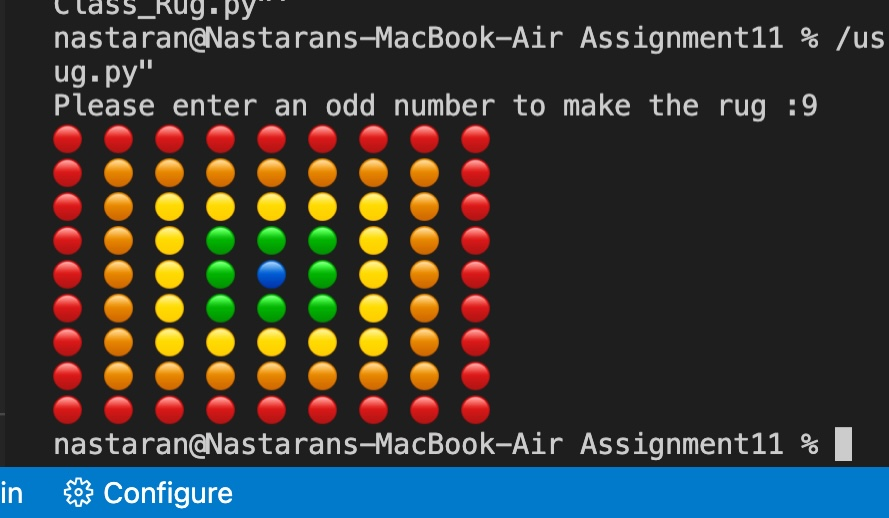

# Assignment 11 :

**Fraction Operations:** Used object-oriented programming to implement addition, subtraction, multiplication, division, conversion to number, and simplification of fractions.

**Time Calculations:** Used object-oriented programming to handle addition, subtraction, conversion to and from seconds, and timezone conversion for time.

**Complex Number Operations:** Used object-oriented programming to implement addition, subtraction, and multiplication of complex numbers.

**Rug Creation:** If the input number is odd, an n*n rug is created using emojis.

