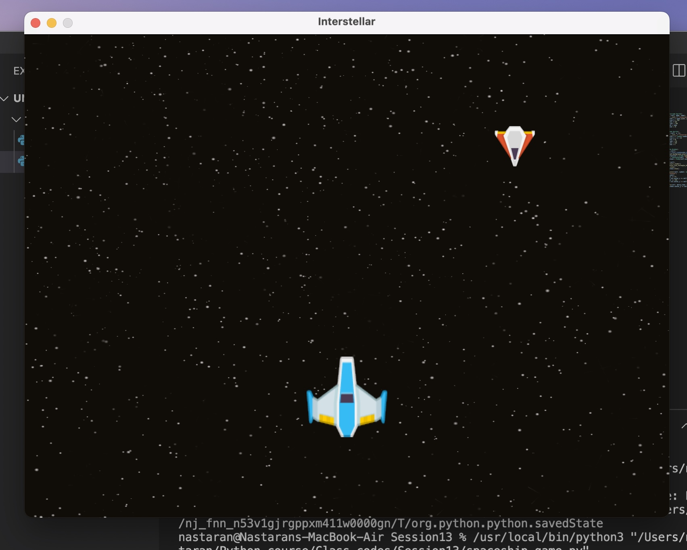
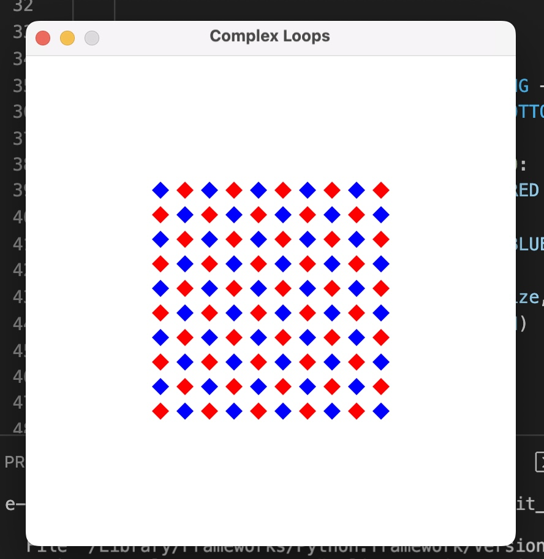

# Assignment 13 :

**Spaceship Game:**
This project is a simple spaceship game implemented using object-oriented programming (OOP) principles and the arcade library in Python. The game features a spaceship controlled by the player and an enemy spaceship that moves down the screen. The player's spaceship can be moved left and right using the keyboard, and the game showcases basic game mechanics such as movement, sprite rendering, and background textures. The primary goal of this project is to demonstrate the use of OOP in structuring a game, making the code more modular and easier to maintain.



**How to Run:**

To run this project, you need to install the following Python library:

```python
pip install arcade
```

After installing the necessary library , you can start the game by executing the **spaceship_game.py** file.


---

**Complex Loop :**

This project demonstrates the creation of a grid of alternating red and blue diamond shapes using object-oriented programming (OOP) with the arcade library. The primary goal is to render the shapes in a structured and modular way by defining a Diamond class that encapsulates the properties and drawing logic for each diamond. The Game class manages the window and handles the rendering loop, ensuring that the diamond grid is displayed correctly. This approach simplifies the code and makes it easier to maintain and expand.



**How to Run:**

To run this project, you need to install the arcade library.
Once the library is installed, you can execute the **complex_loop.py** file to display the grid of diamonds.
