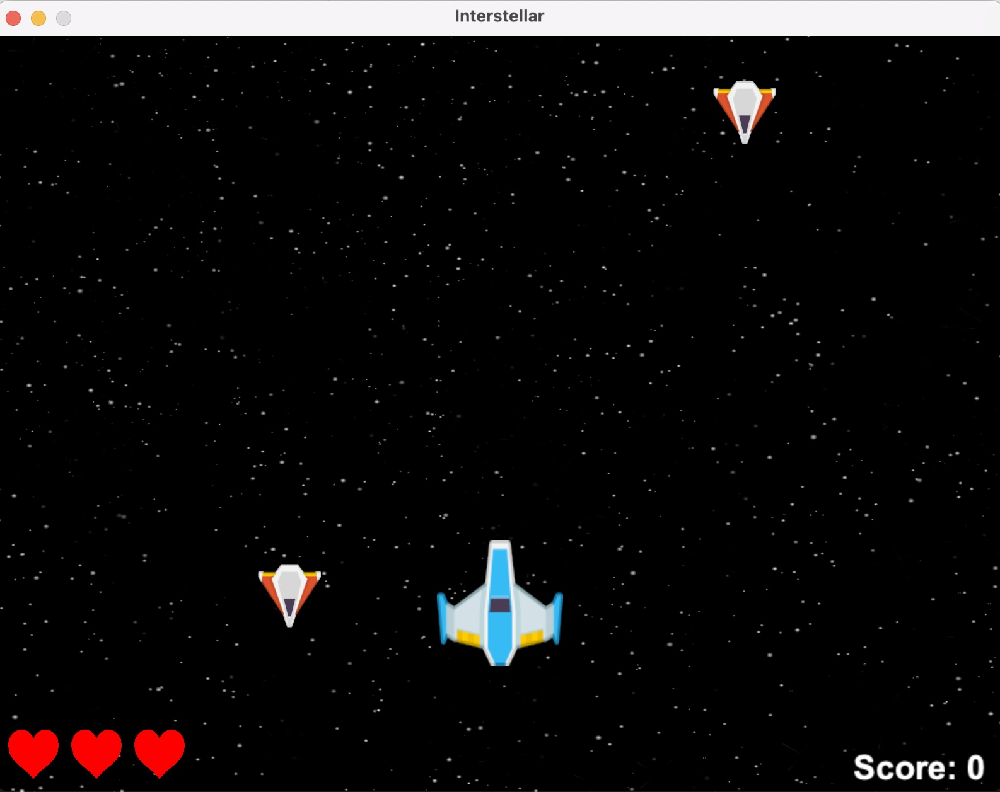
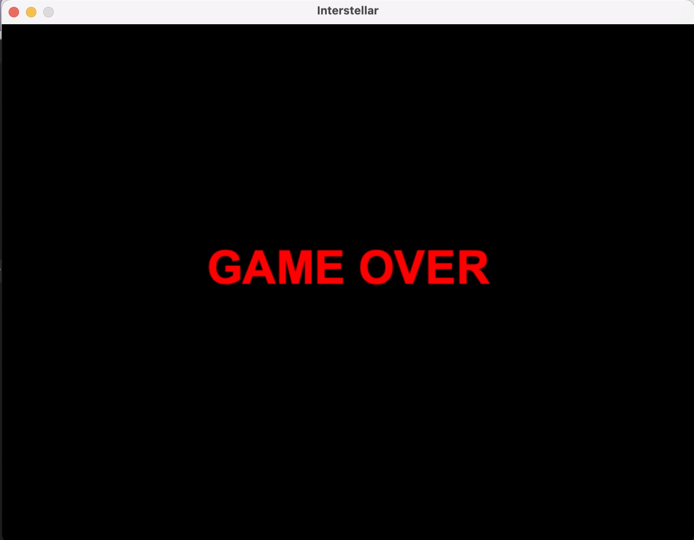

# Assignment 14 : Spaceship Game

**Overview**

Spaceship Game is a simple arcade-style game where you control a spaceship to shoot down enemies and avoid collisions. The game includes basic features such as scoring, lives, and gradually increasing difficulty.






____


**Features**

Spaceship Movement: Move left and right to dodge enemies.

Firing Mechanism: Shoot bullets to destroy enemies.

Enemies: Enemies spawn periodically and move downward.

Scoring: Earn points for each enemy destroyed.

Lives: Lose a life if an enemy collides with your spaceship.

Difficulty: Enemies increase in speed over time.

____


**How to Run:**
You can install the Arcade library using pip:

```python
pip install arcade
```

After installing the necessary library , you can start the game by executing the **spaceship_game.py** file.

____

**Game Controls:**

Left Arrow: Move the spaceship left.

Right Arrow: Move the spaceship right.

Spacebar: Fire bullets.


